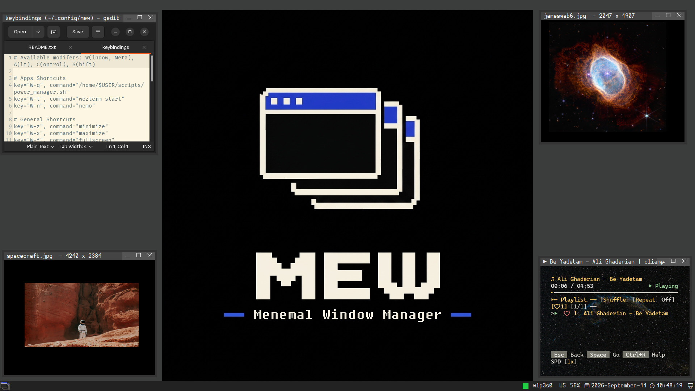

# mew
A minimal, fast desktop environment for X.

<p align="center">
  
</p>

# dependencies
## tools
```
git
gcc
Bear
pkgconf
fzf (optioanl)
```

## build-time
```
libXft-devel
freetype-devel
libXcursor-devel
alsa-lib-devel
```

## build
First you need to clone the project:
  git clone https://github.com/LinArcX/mew

Then, for building it there are two possible ways:
1. using ./scripts/build_debug.sh
  chmod +x scripts/build_debug.sh
  ./scripts/build_debug.sh
2. using ./p. Which gives you an interactive cli with more options. NOTE that fzf should be installed in this case.
  chmod +x p
  ./p

# run
## xephyr
  `./start_xephyr.sh`

## tty
put this line into: ~/.xinitrc.mew
  `exec <PATH>/mew`

Then:
  `startx ~/.xinitrc.mew -- :1`

## configure mew
configuration files reside here:
  `~/.config/mew`

1. `~/.config/mew/autostart`: the things you want to start automatically when mew starts:
```
# terminal
wezterm &
```

2. `~/.config/mew/keybindings`: for defining keybindings:
```

# Available modifers: W(indow, Meta), A(lt), C(ontrol), S(hift)

# Apps Shortcuts
key="W-q", command="/home/$USER/scripts/power_manager.sh"
key="W-t", command="wezterm start"
key="W-n", command="nemo"

# General Shortcuts
key="W-z", command="minimize"
key="W-x", command="maximize"
key="W-f", command="fullscreen"
key="W-c", command="center"
key="W-Left", command="snap-left"
key="W-Right", command="snap-right"
key="W-Up", command="snap-top"
key="W-Down", command="snap-bottom"

key="Print", command="/home/$USER/scripts/screenshot_fullscreen.sh"
key="W-Print", command="/home/$USER/scripts/screenshot_region.sh"
key="XF86AudioRaiseVolume", command="amixer set PCM 5%+"
key="XF86AudioLowerVolume", command="amixer set PCM 5%-"

# StartMenu Shortcuts
key="W-a" command="apps"
key="W-k" command="keybindings"
key="W-p" command="power-manager"
```

Note: mew only supports `.wav` audio files. you can convert any format to `.wav` with ffmpeg:
  `ffmpeg -i xp_shutdown.mp3 xp_shutdown.wav`
